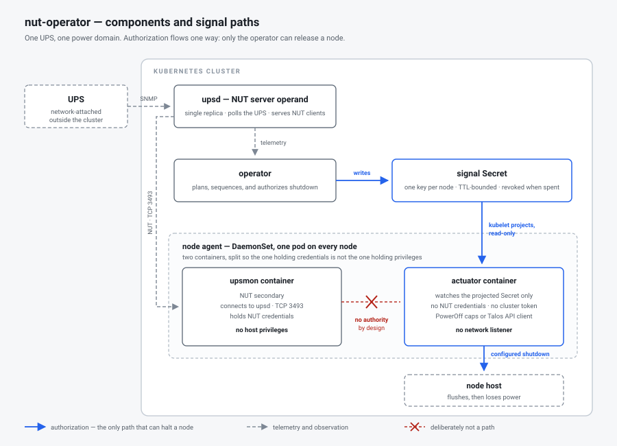

# nut-operator

> [!WARNING]
> **This project is not finished and is not ready to use. It is pre-v1 and under active construction.**
>
> Nothing here is complete until there is a tagged `v1` release. Until then, expect APIs, CRD
> schemas, defaults, and behavior to change without migration paths, and expect gaps between what
> the documentation describes and what is wired end to end. Do not install this expecting a
> finished operator, and do not point it at equipment you cannot afford to have shut down
> unexpectedly.
>
> If you want to follow along or try pieces of it, that is welcome — just size your expectations to
> "in-progress build", not "product".

Kubernetes-native power management built around Network UPS Tools (NUT), controller-runtime, and declarative APIs.

> Disclosure: this project is mostly AI-assisted/vibe-coded. Treat the implementation as requiring normal independent review, security validation, and production qualification before relying on it for real power events.

## What it does

When the power fails, something has to decide what stops first.

A UPS gives a cluster a few minutes of battery. Spending those minutes well means shutting down in a
deliberate order — shed the disposable workloads, quiesce the databases, drain the workers, and stop
the control plane last — rather than losing every machine at once when the battery runs out.
`nut-operator` is the thing that decides that order and carries it out.

It reads UPS state through [Network UPS Tools](https://networkupstools.org/) (NUT), compiles a
shutdown plan from what you declared about your own hardware, and executes that plan wave by wave
while re-checking how much runtime is actually left. Everything is a Kubernetes resource, so the plan
is reviewable in Git and visible in `kubectl` long before a real outage exercises it.

Two things it deliberately does **not** do. It does not bring anything back up — recovery is a
separate control path and belongs to whatever already owns your bring-up. And it does not act on
anything except power state; a node that needs draining for a kernel patch is somebody else's job.

## Components



The moving parts, and why each one is separate from the others:

- **`upsd` — the NUT server operand.** Talks to the UPS and serves NUT clients. One replica per
  logical server. This is the only thing that speaks to power hardware.
- **The operator (controller manager).** Reads telemetry, resolves your declared topology into power
  domains, compiles `ShutdownFlow` policy into ordered waves, and decides when to release each node.
  It is the only component with the authority to halt anything.
- **The node agent — a DaemonSet, one pod on every node.** Split into two containers on purpose, so
  the container holding credentials is not the container holding privileges:
  - **`upsmon`** is a NUT client. It holds NUT credentials, reaches `upsd` over TCP 3493, and has no
    host privileges and no way to stop a machine.
  - **The actuator** holds no NUT credentials and no Kubernetes token, and runs no network listener.
    It watches one read-only projected Secret and, if a valid signal appears there, flushes the
    filesystems and powers the host off.
- **PostgreSQL (CloudNativePG or external).** Holds the durable record: execution history, audit
  rows, and observed durations that sharpen future estimates.

The red crossed line in the diagram is the point of the whole arrangement. `upsmon` sees the power
event first and still cannot act on it — the only path that halts a node runs through the operator,
because only the operator knows what else is still running. That is `OD-37`, and the
[security model](docs/reference/security.md) covers what it costs and why it was chosen anyway.

## Vocabulary

Four words carry most of the design, and two of them are easy to confuse:

- **Tier** — a number *you write* on a workload, namespace, or node saying how late it may stop.
  Higher tiers stop earlier. Tier 1 is the last orchestrated node stop; tier 0 is "last-ditch",
  workload-only, and a flow may not target it.
- **Wave** — a set of work the planner *derived*, eligible to run concurrently. You never write a
  wave. The planner produces them from tiers and dependencies, and execution proceeds wave by wave.
- **Group** — the unit you actually author in a `ShutdownFlow`: a selector, an action, a timeout,
  and its relationships to other groups.
- **Power domain** — everything downstream of one UPS, derived by following `feeds` edges. Derived,
  never declared. A node can sit in more than one.

Tiers are input; waves are output. If a document seems to use them interchangeably, the document is
wrong. Ordering comes from tiers plus `requires`/`before`/`after` and nothing else — there is no
third knob. Full glossary in [the glossary](docs/reference/glossary.md).

## What it runs against

**UPS hardware** must be reachable over the network. Local USB and serial UPS connections are
deliberately unsupported: they would require host device mounts and privileged operand pods for a
topology this project does not target.

Two ways to connect:

- **Direct NUT drivers**, from a reviewed allowlist — SNMP, Network Management Card XML, apcupsd,
  and a simulation driver ([the list](docs/reference/api.md#power-hardware)). Unknown drivers are
  rejected at admission rather than passed through.
- **Upstream NUT relay**, for appliances that already run their own `upsd` — a NAS, or a UPS with an
  embedded NUT server. The operand relays from it instead of driving the device directly.

**Clusters.** Any conformant Kubernetes cluster. Nothing assumes a distribution, a cloud, or a CNI.
Node actuation needs a Linux host, since powering off is the `reboot(2)` syscall.

**Networking.** Agents reach `upsd` on TCP 3493; the operator reaches the Kubernetes API and
PostgreSQL. `NUTServer` is not exposed outside the cluster by default, operands are compatible with
default-deny namespaces, and the operator's only outbound path is an allowlisted `ShutdownHook`
endpoint. NUT protocol TLS defaults to `Required`.

**What is not supported yet:** PDU outlet control (`PDUCapabilityProfile` is schema-only scaffolding),
switches and routers as actuation targets, and USB or serial UPS attachment.

## Goals

- Manage multiple NUT server instances, many network-reachable UPS devices, and multiple physical
  power domains from one operator.
- Keep UPS telemetry, policy compilation, and node actuation as separate concerns with separate
  privileges.
- Default to dry-run, and make the compiled plan reviewable in `/status` before anything can halt a
  node.
- Publish the plan as consumable facts — execution plan, dependency graph, waves, progress,
  explanations — so dashboards, monitoring, and recovery tooling can subscribe rather than integrate.
- Treat Kubernetes resources, Events, logs, and GitOps-managed manifests as the v1 user interface.
  There is no embedded dashboard.
- Decline the Operator Framework's "Auto Pilot" maturity level by design: no auto-scaling,
  auto-tuning, or auto-remediation. Power state is the only trigger the operator acts on.

## Safety model

Real host shutdown is not the default, and reaching it takes four separate, reviewable steps.

`NodePowerAgent` ships as `mode: DryRun` with `shutdown.actuatorPolicy: Simulate`. Rendering
`PowerOff` needs `spec.mode: Actuate` **and** an approval annotation on that exact resource.
`ShutdownFlow` follows the same pattern for `mode: Enforce`. Both approvals are re-checked when the
flow fires rather than when it was deployed, and absence of either drops to dry-run instead of
proceeding.

The node agent's two containers split credentials from privilege: `upsmon` holds NUT credentials and
cannot stop a machine; the actuator can stop a machine and holds no NUT credentials, no Kubernetes
token, and no network listener.

**One path authorizes a halt** (`OD-37`). NUT's own local `SHUTDOWNCMD` path keeps its writer, its
format, and its file, and holds no authority — the shared tmpfs is not mounted into the actuator, so
no supported configuration lets that file stop a node. A local backstop was declined deliberately,
and the accepted cost is stated plainly in `SB-3`: an undeliverable signal leaves nodes running until
the UPS dies.

Full treatment in [Security](docs/reference/security.md); the walk from dry-run to actuation is
[its own guide](docs/guides/enable-actuation.md).

## Architecture and API

The control plane separates **detect** (NUT polling, telemetry normalization, inventory resolution,
capability matching), **decide** (trigger evaluation and planner compilation into ordered waves), and
**act** (workload coordination, node-agent handoff, approved host shutdown). Durable records go to
PostgreSQL; Kubernetes status stays a current-state review surface rather than an event log.

- [Architecture](docs/concepts/architecture.md) — the components, the diagrams, and how a power event
  moves through them.
- [API reference](docs/reference/api.md) — every `power.zalud.io/v1alpha1` kind, what each is for,
  and how they relate.

## Installation

Needs a Kubernetes cluster, a webhook serving certificate, and PostgreSQL for production use
(CloudNativePG or external). The recommended path has no cert-manager dependency:

```sh
kubectl apply -f https://github.com/MichaelZalud18/nut-operator/releases/latest/download/install-byo-cert.yaml
./hack/webhook-cert.sh
```

If you already run cert-manager and want certificate renewal automated, `install.yaml` is the other
supported bundle. Which one to pick, and why it matters during an outage, is
[its own page](docs/installation/webhook-certificate.md).

Everything defaults to dry-run: a `ShutdownFlow` compiles and publishes its full plan without
touching a node until enforcement is explicitly enabled.

Full prerequisites, the Kustomize path, network and firewall requirements, a configuration
walkthrough, upgrade and uninstall order, and troubleshooting are in
[docs/installation/](docs/installation/README.md).

## Development

Building and deploying from a clone:

```sh
make docker-build docker-push IMG=<registry>/nut-operator:<tag>
make install                                    # CRDs
make deploy IMG=<registry>/nut-operator:<tag>   # controller
make deploy-catalog                             # UPS capability profiles
kubectl apply -k config/samples/                # example resources
```

`make deploy-catalog` applies the project-maintained capability catalog: reusable product/SKU
profiles, not site inventory. Run it after the CRDs and controller are installed.

For release bundles:

```sh
make build-installer build-catalog IMG=<registry>/nut-operator:<tag>
```

Test, lint, and security-scan commands, and what to run before opening a pull request, are in
[CONTRIBUTING.md](CONTRIBUTING.md#development-checks).

## Documentation

Start at **[docs/](docs/README.md)** — it carries a first-hour path and a map of the whole set.

- **[Concepts](docs/concepts/README.md)** — what the system is: the control plane, the two operands,
  how a power event moves through them, and where the pods land.
- **[Installation](docs/installation/README.md)** — prerequisites and the install itself, the
  [webhook certificate decision](docs/installation/webhook-certificate.md),
  [configuration](docs/installation/configuration.md) in dependency order, and
  [upgrade and uninstall](docs/installation/upgrade-and-uninstall.md).
- **[Guides](docs/guides/README.md)** — the judgement calls the operator cannot make for you:
  [preparing the hardware](docs/guides/prepare-your-hardware.md),
  [modeling your topology](docs/guides/model-your-topology.md),
  [assigning tiers](docs/guides/assign-shutdown-tiers.md),
  [choosing what is last-ditch](docs/guides/choose-last-ditch-workloads.md),
  [setting a tier-overrun policy](docs/guides/set-tier-overrun-policy.md), and
  [enabling actuation](docs/guides/enable-actuation.md).
- **[Reference](docs/reference/README.md)** — [API](docs/reference/api.md),
  [glossary](docs/reference/glossary.md), [metrics](docs/reference/metrics.md),
  [security](docs/reference/security.md), [images](docs/reference/images.md).
- **[Examples](docs/examples/README.md)** — [orion cluster](docs/examples/orion-cluster/README.md),
  [simulation scenarios](docs/examples/simulation/README.md).
- **[Troubleshooting](docs/troubleshooting.md)** — symptoms and causes.
- **[Contributing](docs/contributing/README.md)** — the design set and the audits behind it:
  [scope boundaries](docs/contributing/design/scope-boundaries.md),
  [settled questions](docs/contributing/design/settled-questions.md),
  [decision index](docs/contributing/design/decision-index.md).
- **[Project tasks](docs/tasks.md)** — what is left before v1.

## Community and Project Info

- [Contributing](CONTRIBUTING.md)
- [Code of Conduct](CODE_OF_CONDUCT.md)
- [Security Policy](SECURITY.md)
- [Support](SUPPORT.md)
- [Governance](GOVERNANCE.md)
- [Maintainers](MAINTAINERS.md)

## License

Copyright 2026 Michael Zalud.

Licensed under the [Apache License, Version 2.0](LICENSE).
