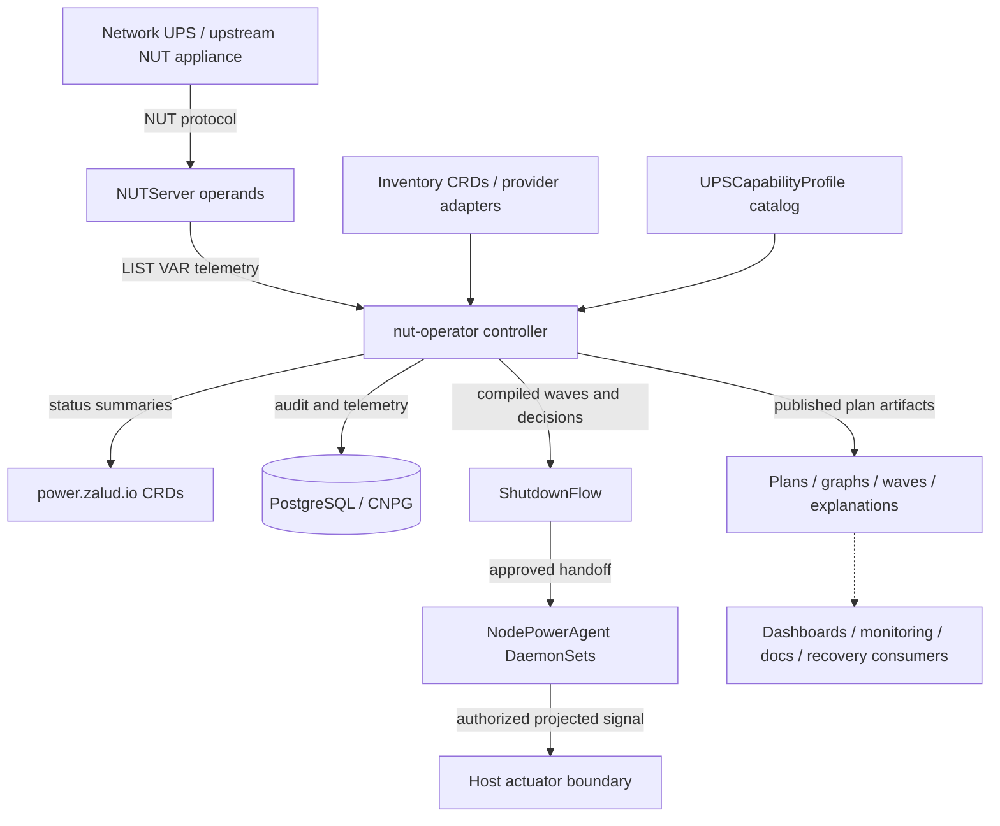

# nut-operator

> [!WARNING]
> **This project is not finished and is not ready to use. It is pre-v1 and under active construction.**
>
> Nothing here is complete until there is a tagged `v1` release. Until then, expect APIs, CRD
> schemas, defaults, and behavior to change without migration paths, and expect gaps between what
> the documentation describes and what is wired end to end. Do not install this expecting a
> finished operator, and do not point it at equipment you cannot afford to have shut down
> unexpectedly.
>
> If you want to follow along or try pieces of it, that is welcome — just size your expectations to
> "in-progress build", not "product".

Kubernetes-native power management built around Network UPS Tools (NUT), controller-runtime, and declarative APIs.

> Disclosure: this project is mostly AI-assisted/vibe-coded. Treat the implementation as requiring normal independent review, security validation, and production qualification before relying on it for real power events.

## What it does

When the power fails, something has to decide what stops first.

A UPS gives a cluster a few minutes of battery. Spending those minutes well means shutting down in a
deliberate order — shed the disposable workloads, quiesce the databases, drain the workers, and stop
the control plane last — rather than losing every machine at once when the battery runs out.
`nut-operator` is the thing that decides that order and carries it out.

It reads UPS state through [Network UPS Tools](https://networkupstools.org/) (NUT), compiles a
shutdown plan from what you declared about your own hardware, and executes that plan wave by wave
while re-checking how much runtime is actually left. Everything is a Kubernetes resource, so the plan
is reviewable in Git and visible in `kubectl` long before a real outage exercises it.

Two things it deliberately does **not** do. It does not bring anything back up — recovery is a
separate control path and belongs to whatever already owns your bring-up. And it does not act on
anything except power state; a node that needs draining for a kernel patch is somebody else's job.

## Components


The moving parts, and why each one is separate from the others:

- **`upsd` — the NUT server operand.** Talks to the UPS and serves NUT clients. One replica per
  logical server. This is the only thing that speaks to power hardware.
- **The operator (controller manager).** Reads telemetry, resolves your declared topology into power
  domains, compiles `ShutdownFlow` policy into ordered waves, and decides when to release each node.
  It is the only component with the authority to halt anything.
- **The node agent — a DaemonSet, one pod on every node.** Split into two containers on purpose, so
  the container holding credentials is not the container holding privileges:
  - **`upsmon`** is a NUT client. It holds NUT credentials, reaches `upsd` over TCP 3493, and has no
    host privileges and no way to stop a machine.
  - **The actuator** holds no NUT credentials and no Kubernetes token, and runs no network listener.
    It watches one read-only projected Secret and, if a valid signal appears there, flushes the
    filesystems and powers the host off.
- **PostgreSQL (CloudNativePG or external).** Holds the durable record: execution history, audit
  rows, and observed durations that sharpen future estimates.

The red crossed line in the diagram is the point of the whole arrangement. `upsmon` sees the power
event first and still cannot act on it — the only path that halts a node runs through the operator,
because only the operator knows what else is still running. That is `OD-37`, and the
[security model](docs/reference/security.md) covers what it costs and why it was chosen anyway.

## Vocabulary

Four words carry most of the design, and two of them are easy to confuse:

- **Tier** — a number *you write* on a workload, namespace, or node saying how late it may stop.
  Higher tiers stop earlier. Tier 1 is the last orchestrated node stop; tier 0 is "last-ditch",
  workload-only, and a flow may not target it.
- **Wave** — a set of work the planner *derived*, eligible to run concurrently. You never write a
  wave. The planner produces them from tiers and dependencies, and execution proceeds wave by wave.
- **Group** — the unit you actually author in a `ShutdownFlow`: a selector, an action, a timeout,
  and its relationships to other groups.
- **Power domain** — everything downstream of one UPS, derived by following `feeds` edges. Derived,
  never declared. A node can sit in more than one.

Tiers are input; waves are output. If a document seems to use them interchangeably, the document is
wrong. Ordering comes from tiers plus `requires`/`before`/`after` and nothing else — there is no
third knob. Full glossary in [the glossary](docs/reference/glossary.md).

## What it runs against

**UPS hardware** must be reachable over the network. Local USB and serial UPS connections are
deliberately unsupported: they would require host device mounts and privileged operand pods for a
topology this project does not target.

Two ways to connect:

- **Direct NUT drivers**, from a reviewed allowlist — `snmp-ups` for SNMP-capable network cards,
  `netxml-ups` for Network Management Card XML, `apcupsd-ups`, and `dummy-ups` for simulation and
  relays. Unknown drivers are rejected at admission rather than passed through.
- **Upstream NUT relay**, for appliances that already run their own `upsd` — a NAS, or a UPS with an
  embedded NUT server. The operand relays from it instead of driving the device directly.

**Clusters.** Any conformant Kubernetes cluster. Nothing assumes a distribution, a cloud, or a CNI.
Node actuation needs a Linux host, since powering off is the `reboot(2)` syscall.

**Networking.** Agents reach `upsd` on TCP 3493; the operator reaches the Kubernetes API and
PostgreSQL. `NUTServer` is not exposed outside the cluster by default, operands are compatible with
default-deny namespaces, and the operator's only outbound path is an allowlisted `ShutdownHook`
endpoint. NUT protocol TLS defaults to `Required`.

**What is not supported yet:** PDU outlet control (`PDUCapabilityProfile` is schema-only scaffolding),
switches and routers as actuation targets, and USB or serial UPS attachment.

## Goals

- Manage multiple NUT server instances from one operator.
- Support many network-reachable UPS devices and physical power domains.
- Keep UPS telemetry, policy compilation, and node actuation as separate concerns.
- Default to dry-run and status-visible compiled plans before allowing any host shutdown.
- Publish reusable planner artifacts: compiled execution plans, dependency graphs, waves, execution progress, and explanations.
- Treat Kubernetes resources, events, logs, and GitOps-managed manifests as the v1 user interface.
- Use Kubernetes-native security controls: least-privilege RBAC, status subresources, conditions, NetworkPolicy-ready operands, read-only roots, seccomp, and explicit host-actuator isolation.
- Keep long-lived audit, telemetry, and flow execution state out of CR status and in PostgreSQL.
- Decline the Operator Framework's "Auto Pilot" maturity level by design: no auto-scaling,
  auto-tuning, or auto-remediation. Power state is the only trigger the operator acts on.

## API Shape

The API group is `power.zalud.io/v1alpha1`.

- `PowerManagementCluster` configures global defaults, operand namespace, images, security posture, observability, and PostgreSQL/CNPG storage.
- `UPSDevice` describes a physical or simulated network-reachable UPS, its NUT driver or upstream NUT relay endpoint, credentials, power domains, thresholds, and telemetry behavior. Local USB and serial UPS modes are intentionally unsupported. The driver allowlist is `snmp-ups`, `netxml-ups`, `apcupsd-ups`, and `dummy-ups` for tests and upstream relays.
- `PowerInfrastructure` describes non-node, non-UPS power or communication path entities such as PDUs, switches, routers, panels, and transfer equipment.
- `PowerInventoryNode` attaches planner-relevant power metadata to Kubernetes node names without replacing the Kubernetes `Node` as the canonical identity.
- `PowerInventoryEdge` declares provider-neutral `Feeds` and `Carries` topology relations between UPS devices, nodes, and infrastructure entities.
- `UPSCapabilityProfile` declares reusable product/SKU capability records: authoritative NUT telemetry variables, UPS actuation behaviors, quirks, and deterministic match selectors. These are not per-site inventory records.
- `UPSCapabilityProbe` reads what a UPS actually reports and drafts a `UPSCapabilityProfile` from it,
  for hardware the bundled catalog does not cover. Advisory only: it never changes how a device
  resolves and never runs on the failure path.
- `NUTServer` renders and operates one logical `upsd` server instance for selected UPS devices.
- `NodePowerAgent` manages the per-node monitoring and actuation DaemonSet. It separates `MonitorOnly`, `DryRun`, and `Actuate` modes.
- `ShutdownFlow` defines dependency-graph shutdown policy compiled into ordered waves. Enforced flows require an explicit approval annotation.
- `ShutdownHook` describes one bounded pre-shutdown call to a system outside the cluster, delivered as HTTP CloudEvents or as a generic Kubernetes object. This is the operator's only outbound network path; endpoints are allowlisted on `PowerManagementCluster`, and a failed hook marks the flow degraded without holding a wave.
- `PDUCapabilityProfile` declares PDU product records, including outlet count and which outlets are switchable. **Scaffolding for v1** (`OD-25`): the kind, schema, validation, bundled catalog, and matcher exist, and no device kind, inventory entity, render path, or actuation path consumes them. PDU actuation does not work.

## Safety Model

Real host shutdown is not the default.

`NodePowerAgent` defaults to dry-run behavior through `mode: DryRun` and `shutdown.actuatorPolicy: Simulate`. Rendering `PowerOff` requires both:

- `spec.mode: Actuate`
- `metadata.annotations[spec.shutdown.approvalAnnotation] == "true"`

`ShutdownFlow` follows the same pattern for `mode: Enforce`. This keeps dangerous behavior reviewable in Git and visible in `/status` before it can affect nodes.

The node-agent pod split is:

- `upsmon` container: unprivileged NUT client, no Kubernetes API credentials required for ordinary monitoring.
- `actuator` container: omitted in `MonitorOnly`, and `Simulate` by default elsewhere — `mode` defaults to `DryRun` and `shutdown.actuatorPolicy` to `Simulate`, two independent gates. Approved real host shutdown watches only the executor-projected signal Secret, then uses the isolated host-action boundary with `hostPID`, `SYS_BOOT`, no Kubernetes token, and no NUT credentials.

One path authorizes a halt (`OD-37`). NUT's local `SHUTDOWNCMD` path keeps its writer, its signal format, and its file, and holds no authority: the shared tmpfs is not mounted into the actuator, so no supported configuration lets that file stop a node. A local backstop was declined deliberately — it would engage exactly when the operator is unreachable, which is when ordering matters most, and `MINSUPPLIES 1` on every agent would release a UPS's whole coverage at once. The accepted cost, per `SB-3`: an undeliverable signal leaves nodes running until the UPS dies.

## Storage

The default durable storage mode is CNPG:

```yaml
spec:
  storage:
    mode: CNPG
    cnpg:
      clusterRef:
        namespace: power-system
        name: power-audit
      database: power
      schema: power
    auditSpool:
      enabled: true
      path: /var/lib/nut-operator/audit-spool
      maxSize: 64Mi
```

External PostgreSQL is also modeled for non-CNPG clusters. `Disabled` exists for local development only.
The audit spool path must be backed by a deployment-supplied durable volume.

## Architecture



The control plane separates detect, decide, and act:

- Detect: NUT polling, UPS status normalization, declarative inventory resolution, capability-profile matching, and topology assembly.
- Decide: pure trigger evaluation and `ShutdownFlow` graph planning into deterministic ordered waves.
- Act: dry-run execution, Kubernetes workload coordination, node-agent handoff, and explicitly approved local host shutdown.

Durable records are written to PostgreSQL. Kubernetes status remains a current-state review surface, not an event log.

## Interface Model

Kubernetes is the primary interface:

- CRDs declare desired state.
- GitOps manages configuration changes.
- `/status`, Kubernetes Events, logs, and PostgreSQL audit records expose current state and history.
- `kubectl` is sufficient for day-to-day operation.

The operator publishes facts, not external commands. Other systems may consume published planner artifacts for dashboards, documentation, monitoring, recovery orchestration, or future automation. The project boundary remains: `nut-operator` owns power-event planning and shutdown execution; subscribers own what they do with the published plan.

## Installation

Requires cert-manager, and PostgreSQL for production use (CloudNativePG or external). Install the
operator with the bundled manifest:

```sh
kubectl apply -f https://raw.githubusercontent.com/MichaelZalud18/nut-operator/main/dist/install.yaml
```

Everything defaults to dry-run: a `ShutdownFlow` compiles and publishes its full plan without
touching a node until enforcement is explicitly enabled.

Full prerequisites, the Kustomize path, network and firewall requirements, a configuration
walkthrough, upgrade and uninstall order, and troubleshooting are in
[docs/installation/](docs/installation/README.md).

## Development

Use a writable Go build cache in restricted shells:

```sh
GOCACHE=/tmp/go-build-cache make generate
GOCACHE=/tmp/go-build-cache make manifests
GOCACHE=/tmp/go-build-cache go test ./api/... ./internal/controller -run TestNonExistent
```

Full controller tests use Kubebuilder envtest assets:

```sh
GOCACHE=/tmp/go-build-cache make setup-envtest
GOCACHE=/tmp/go-build-cache make test
```

Run the AWS Labs Automated Security Helper scan:

```sh
uv tool install 'git+https://github.com/awslabs/automated-security-helper.git@v3.5.8'
make security-scan
```

The target downloads `grype` and `syft` into `bin/` from pinned, checksum-verified release archives;
`grype` is the pipeline's dependency-vulnerability coverage. `cfn-nag`, `cdk-nag`, and `opengrep` are
excluded by decision (no CloudFormation, no CDK, and `semgrep` already covers the same rule surface),
so they report `SKIPPED` rather than `MISSING` — see `ASH_EXCLUDED_SCANNERS` in the `Makefile`.

Build and push the manager image:

```sh
make docker-build docker-push IMG=<registry>/nut-operator:<tag>
```

Install CRDs:

```sh
make install
```

Deploy the controller:

```sh
make deploy IMG=<registry>/nut-operator:<tag>
```

Apply the project-maintained capability catalog after CRDs and the controller are installed:

```sh
make deploy-catalog
```

Apply example resources:

```sh
kubectl apply -k config/samples/
```

Apply the project-maintained capability catalog as CRDs. These are reusable product profiles, not
customer inventory examples:

```sh
kubectl apply -k config/catalog/
```

For release bundles:

```sh
make build-installer build-catalog IMG=<registry>/nut-operator:<tag>
```

## Documentation

Start at **[docs/](docs/README.md)** — it carries a first-hour path and a map of the whole set.

- **[Concepts](docs/concepts/README.md)** — what the system is: the control plane, the two operands,
  the service-level shape, and where the pods land.
- **[Installation](docs/installation/README.md)** — prerequisites and both install paths,
  [configuration](docs/installation/configuration.md) in dependency order, and
  [upgrade and uninstall](docs/installation/upgrade-and-uninstall.md).
- **[Guides](docs/guides/README.md)** — the judgement calls the operator cannot make for you:
  [preparing the hardware](docs/guides/prepare-your-hardware.md),
  [modeling your topology](docs/guides/model-your-topology.md),
  [assigning tiers](docs/guides/assign-shutdown-tiers.md),
  [choosing what is last-ditch](docs/guides/choose-last-ditch-workloads.md),
  [setting a tier-overrun policy](docs/guides/set-tier-overrun-policy.md), and
  [enabling actuation](docs/guides/enable-actuation.md).
- **[Reference](docs/reference/README.md)** — [glossary](docs/reference/glossary.md),
  [metrics](docs/reference/metrics.md), [security](docs/reference/security.md),
  [images](docs/reference/images.md).
- **[Examples](docs/examples/README.md)** — [orion cluster](docs/examples/orion-cluster/README.md),
  [simulation scenarios](docs/examples/simulation/README.md).
- **[Troubleshooting](docs/troubleshooting.md)** — symptoms and causes.
- **[Contributing](docs/contributing/README.md)** — the design set and the audits behind it:
  [scope boundaries](docs/contributing/design/scope-boundaries.md),
  [settled questions](docs/contributing/design/settled-questions.md),
  [decision index](docs/contributing/design/decision-index.md).
- **[Project tasks](docs/tasks.md)** — what is left before v1.

## Community and Project Info

- [Contributing](CONTRIBUTING.md)
- [Code of Conduct](CODE_OF_CONDUCT.md)
- [Security Policy](SECURITY.md)
- [Support](SUPPORT.md)
- [Governance](GOVERNANCE.md)
- [Maintainers](MAINTAINERS.md)

## License

Copyright 2026 Michael Zalud.

Licensed under the [Apache License, Version 2.0](LICENSE).
