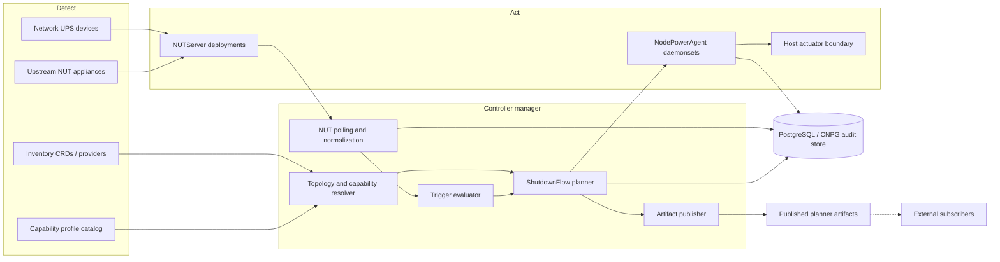
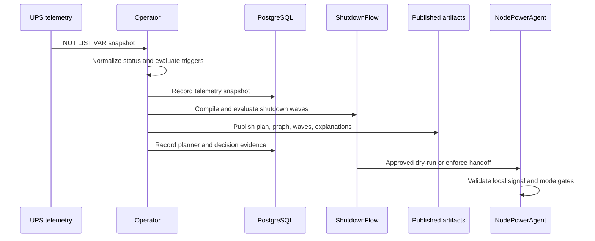

# Architecture

Components: Cross-cutting.

`nut-operator` is split into a control plane, NUT server operands, node power agents, and durable state.

## Control Plane

The operator runs as a controller-runtime manager and reconciles cluster-scoped CRDs in `power.zalud.io/v1alpha1`.

- CRDs carry desired state and small status summaries.
- `/status` carries conditions, observed generation, rendered config hashes, and compiled shutdown plans.
- PostgreSQL carries audit events, telemetry history, and flow execution records.
- Published planner artifacts expose the current execution plan, dependency graph, wave state, and explanations for consumers.
- Admission webhooks reject unsafe `UPSDevice`, capability profile, and declarative inventory combinations before persistence. Reconcilers keep the same checks in status for defense in depth and for installs that temporarily disable webhooks.

## Primary Interface

Kubernetes is the primary user interface for v1.

- CRDs are the configuration and review surface.
- GitOps is the normal configuration mechanism.
- `kubectl`, Kubernetes Events, controller logs, CR status, and PostgreSQL audit queries are sufficient for day-to-day operation.
- There is no embedded dashboard or dedicated frontend in v1.

A future UI is a separate consumer of the operator APIs and published artifacts. It does not become part of the core reconciliation, planning, or execution path.

## Power APIs

`PowerManagementCluster` is the root configuration object. It owns global security defaults, image defaults, observability, operand namespace policy, and storage.

`UPSDevice` represents one physical or simulated network-reachable UPS. It supports either a reviewed NUT network driver or an explicit upstream NUT relay endpoint for appliances that already expose `upsd`. Local USB and serial drivers are out of scope for this API so generated NUT server pods do not need host device mounts or privileged access for UPS connectivity. New direct drivers are added to the network-driver allowlist deliberately; the set is `snmp-ups`, `netxml-ups`, `powerman-pdu`, `apcupsd-ups`, and `dummy-ups` for tests and upstream relays.

`NUTServer` represents one logical `upsd` instance. It selects one or more `UPSDevice` objects and renders server-side NUT configuration, credentials, TLS material references, and service exposure.

For built-in NUT appliances, `NUTServer` renders `dummy-ups` repeater mode rather than direct hardware drivers. This keeps Ubiquiti-style network UPS support non-privileged and avoids USB/serial host access.

`NodePowerAgent` represents one DaemonSet fleet. It references one or more `NUTServer` objects, selects nodes, and declares whether the fleet is monitoring, dry-running, or allowed to actuate.

`ShutdownFlow` is the ordered policy layer. Its primary model is a dependency graph of shutdown groups compiled into deterministic execution waves. Linear steps remain available for small test installs, but production flows use graph relationships so independent groups can run concurrently while dependent groups stay protected.

See [shutdown-flow.md](shutdown-flow.md) for the underlying flow design.

## Operand Model

The generated resources are:

- `Deployment` for each `NUTServer`.
- `Service` for each `NUTServer`.
- `ConfigMap` for rendered NUT config.
- `Secret` for generated NUT users when operator-managed auth is selected.
- `DaemonSet` for each `NodePowerAgent`.
- `NetworkPolicy` for server, agent, metrics, and database traffic.
- `ServiceMonitor` when Prometheus Operator integration is enabled.
- A per-agent projected signal `Secret` used by the executor to release individual nodes without
  giving the actuator Kubernetes API credentials.

## Node Agent Pod

The default node agent pod is a network-only, non-privileged monitor. A host-action sidecar is
rendered only when monitoring is not explicitly disabled.

- `upsmon`: unprivileged NUT client, read-only root filesystem, no capabilities, no Kubernetes API
  token, and a packaged `power-signal-writer` used by NUT `SHUTDOWNCMD`.
- `actuator`: omitted in `MonitorOnly` or stubbed by default. In approved host-actuation mode, it
  watches local and projected signal files and performs the host shutdown path without NUT
  credentials or policy authority.

The handoff file contains structured content including execution ID, node name, timestamp, reason,
UPS identity, flow identity, and plan hash. The actuator rejects stale, malformed, or wrong-node
signals. The executor writes projected per-node Secret keys for orchestrated releases; `upsmon`
writes the same JSON shape locally for NUT FSD events.

## Storage Model

PostgreSQL is the durable state store. CloudNativePG is the preferred in-cluster implementation, but the API accepts external PostgreSQL as well.

Do not store event history, telemetry streams, or execution logs in CR status. CR status is for current state summaries, conditions, and compiled plan review.

## Publishing Model

The operator publishes facts, not external commands. The planner and executor publish:

- The compiled execution plan.
- The dependency graph with edge provenance and explanations.
- Shutdown waves and advisory startup wave projections.
- Trigger decisions and planner explanations.
- Current execution state and wave progress.

Publishing targets are Kubernetes status for compact current state, Kubernetes Events for state transitions, logs for operator-readable detail, and PostgreSQL for durable history. Visualization is exported from the same structured artifacts as Mermaid, Graphviz/DOT, and D2; those rendered formats are views, not sources of truth.

No message broker is bundled for v1. Kubernetes API watch semantics on `ShutdownFlow` status are the
pub/sub surface for current artifacts; Events, logs, and PostgreSQL provide transitions, operator
detail, and durable history.

Subscribers can include recovery orchestration, dashboards, documentation generators, monitoring systems, and future automation. The boundary is explicit: `nut-operator` owns power-event planning and shutdown; other systems consume the published plan.

## Shutdown Flow Compilation

`ShutdownFlow` compilation turns user-declared `groups` into status-visible `compiledWaves`.

- `requires` means a referenced group must stay available while the current group shuts down.
- `before` and `after` are direct ordering edges.
- `phase` is a fallback ordering hint for groups that are otherwise ready at the same time.
- Cycles and unknown group references are rejected before a plan can be accepted.
- Each compiled wave may execute groups concurrently; later waves wait for earlier waves to complete.

This keeps the CRD declarative while giving operators a reviewable plan before `Enforce` mode is allowed.

## Decision Flow

The operator treats PostgreSQL as the durable record path, not as the critical decision path. A
storage outage degrades auditability but does not erase the current CR specs or compiled status
surfaces that drive power response. During shutdown execution, an explicitly configured local audit
spool preserves replayable JSONL records when PostgreSQL stops accepting writes.

## Resiliency

Loss of connectivity between the operator, API server, NUT servers, PostgreSQL, or node agents is a
degraded state, not a permission to assume success. Stale telemetry produces `Unknown` or degraded
planner output, unreachable nodes are not treated as released or powered off, and node-local
actuation only honors fresh structured signals for the receiving node.

See [resiliency-and-partitions.md](design/resiliency-and-partitions.md) for the partition contract.
