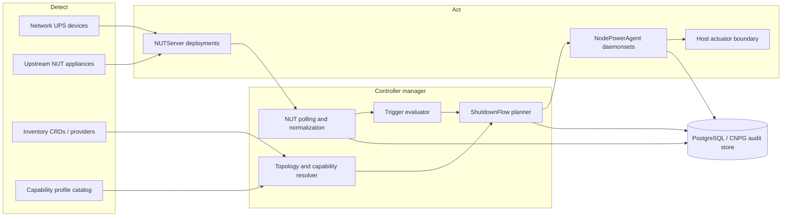
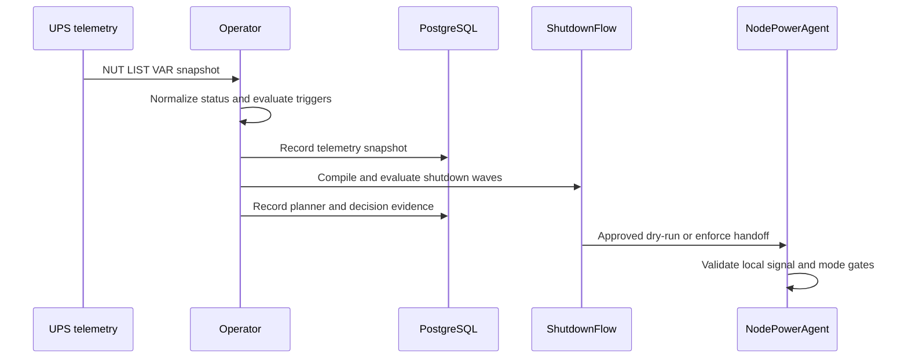

# Architecture

`nut-operator` is split into a control plane, NUT server operands, node power agents, and durable state.

## Control Plane

The operator runs as a controller-runtime manager and reconciles cluster-scoped CRDs in `power.zalud.io/v1alpha1`.

- CRDs carry desired state and small status summaries.
- `/status` carries conditions, observed generation, rendered config hashes, and compiled shutdown plans.
- PostgreSQL carries audit events, telemetry history, and flow execution records.
- Admission webhooks reject unsafe `UPSDevice`, capability profile, and declarative inventory combinations before persistence. Reconcilers keep the same checks in status for defense in depth and for installs that temporarily disable webhooks.

## Power APIs

`PowerManagementCluster` is the root configuration object. It owns global security defaults, image defaults, observability, operand namespace policy, and storage.

`UPSDevice` represents one physical or simulated network-reachable UPS. It supports either a reviewed NUT network driver or an explicit upstream NUT relay endpoint for appliances that already expose `upsd`. Local USB and serial drivers are out of scope for this API so generated NUT server pods do not need host device mounts or privileged access for UPS connectivity. New direct drivers are added to the network-driver allowlist deliberately; the set is `snmp-ups`, `netxml-ups`, `powerman-pdu`, `apcupsd-ups`, and `dummy-ups` for tests and upstream relays.

`NUTServer` represents one logical `upsd` instance. It selects one or more `UPSDevice` objects and renders server-side NUT configuration, credentials, TLS material references, and service exposure.

For built-in NUT appliances, `NUTServer` renders `dummy-ups` repeater mode rather than direct hardware drivers. This keeps Ubiquiti-style network UPS support non-privileged and avoids USB/serial host access.

`NodePowerAgent` represents one DaemonSet fleet. It references one or more `NUTServer` objects, selects nodes, and declares whether the fleet is monitoring, dry-running, or allowed to actuate.

`ShutdownFlow` is the ordered policy layer. Its primary model is a dependency graph of shutdown groups compiled into deterministic execution waves. Linear steps remain available for small test installs, but production flows use graph relationships so independent groups can run concurrently while dependent groups stay protected.

See [shutdown-flow.md](shutdown-flow.md) for the underlying flow design.

## Operand Model

The generated resources are:

- `Deployment` for each `NUTServer`.
- `Service` for each `NUTServer`.
- `ConfigMap` for rendered NUT config.
- `Secret` for generated NUT users when operator-managed auth is selected.
- `DaemonSet` for each `NodePowerAgent`.
- `NetworkPolicy` for server, agent, metrics, and database traffic.
- `ServiceMonitor` when Prometheus Operator integration is enabled.

## Node Agent Pod

The default node agent pod is a network-only, non-privileged monitor. A host-action sidecar is rendered only for explicit actuation modes.

- `upsmon`: unprivileged NUT client, read-only root filesystem, no capabilities, no Kubernetes API token unless a declared feature explicitly needs it.
- `actuator`: omitted or stubbed by default. In approved host-actuation mode, it watches a shared in-pod signal file and performs the host shutdown path without NUT credentials or policy authority.

The handoff file must contain structured content, including timestamp, reason, UPS identity, and flow identity. Actuator implementations must reject stale files.

## Storage Model

PostgreSQL is the durable state store. CloudNativePG is the preferred in-cluster implementation, but the API accepts external PostgreSQL as well.

Do not store event history, telemetry streams, or execution logs in CR status. CR status is for current state summaries, conditions, and compiled plan review.

## Shutdown Flow Compilation

`ShutdownFlow` compilation turns user-declared `groups` into status-visible `compiledWaves`.

- `requires` means a referenced group must stay available while the current group shuts down.
- `before` and `after` are direct ordering edges.
- `phase` is a fallback ordering hint for groups that are otherwise ready at the same time.
- Cycles and unknown group references are rejected before a plan can be accepted.
- Each compiled wave may execute groups concurrently; later waves wait for earlier waves to complete.

This keeps the CRD declarative while giving operators a reviewable plan before `Enforce` mode is allowed.

## Decision Flow

The operator treats PostgreSQL as the durable record path, not as the critical decision path. A storage outage degrades auditability but does not erase the current CR specs or compiled status surfaces that drive power response.
