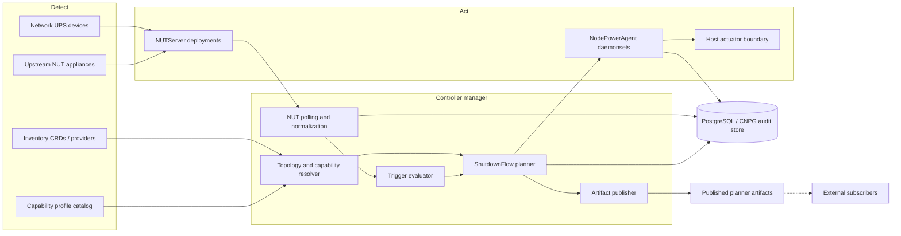
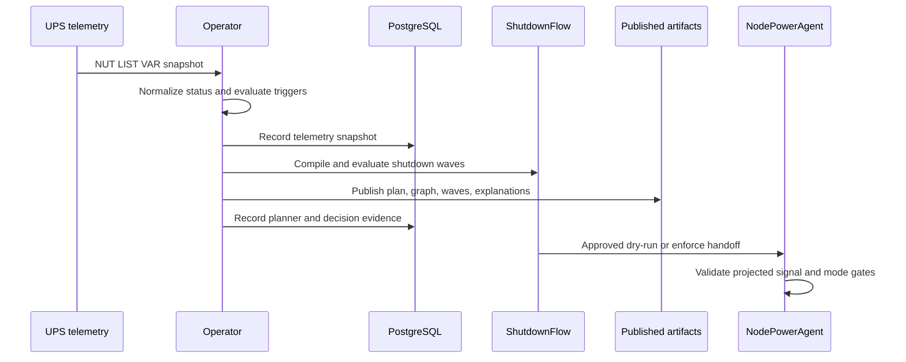
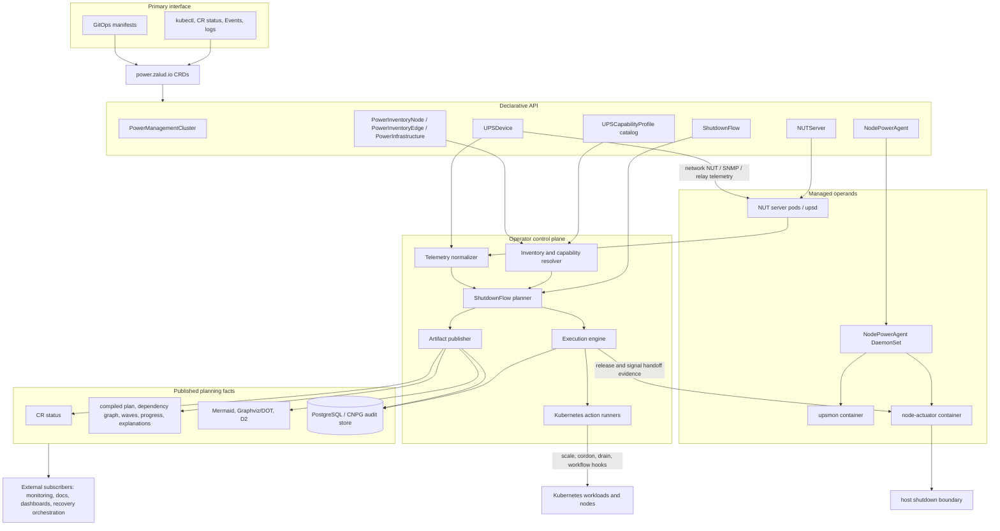

# Architecture

Components: Cross-cutting.
Audience: operators and evaluators.

`nut-operator` is split into a control plane, NUT server operands, node power agents, and durable
state. This page explains what each part is and how a power event moves through them. For what to
*write*, see the [API reference](../reference/api.md); for what to *decide*, see
[Guides](../guides/README.md).

## The three stages

Everything the operator does falls into detect, decide, or act, and the split is deliberate: the
component that talks to power hardware is not the component that decides anything, and neither one is
the component that can stop a machine.

- **Detect** — NUT polling, UPS status normalization, declarative inventory resolution,
  capability-profile matching, and topology assembly.
- **Decide** — pure trigger evaluation and `ShutdownFlow` graph planning into deterministic ordered
  waves. This stage queries nothing live; its inputs are authored and hashed.
- **Act** — dry-run execution, Kubernetes workload coordination, node-agent handoff, and explicitly
  approved host shutdown.

## Control plane

The operator runs as a controller-runtime manager and reconciles cluster-scoped CRDs in
`power.zalud.io/v1alpha1`.

- CRDs carry desired state and small status summaries.
- `/status` carries conditions, observed generation, rendered config hashes, and compiled shutdown
  plans.
- PostgreSQL carries audit events, telemetry history, and flow execution records.
- Admission webhooks reject unsafe combinations before persistence, with the same checks repeated in
  reconcilers for defense in depth.

Kubernetes is the whole interface for v1. CRDs are the configuration and review surface, GitOps is the
normal way to change them, and `kubectl` plus Events, logs, CR status, and PostgreSQL queries are
sufficient for day-to-day operation. There is no embedded dashboard (`SB-14`); a future UI would be
another consumer of the published artifacts, not part of the reconciliation path.

## Operands

Each `NUTServer` and `NodePowerAgent` renders a set of ordinary Kubernetes objects:

- `Deployment` and `Service` for each `NUTServer`, plus a `ConfigMap` for rendered NUT config and a
  `Secret` for generated NUT users when operator-managed auth is selected.
- `DaemonSet` for each `NodePowerAgent`.
- `NetworkPolicy` for server, agent, metrics, and database traffic.
- `ServiceMonitor` when Prometheus Operator integration is enabled.
- A per-agent projected signal `Secret`, which is how the executor releases individual nodes without
  giving the actuator Kubernetes API credentials.

### The node agent pod

The default node agent pod is a network-only, non-privileged monitor. The host-action container is
rendered only when actuation is configured.

- **`upsmon`** — unprivileged NUT client, read-only root filesystem, no capabilities, no Kubernetes
  API token, and a packaged `power-signal-writer` used by NUT `SHUTDOWNCMD`.
- **`actuator`** — omitted entirely in `MonitorOnly`, and `Simulate` by default elsewhere. In approved
  actuation mode it watches the executor-projected Secret path and performs the host shutdown without
  NUT credentials or policy authority.

The signal is structured content carrying execution ID, node name, timestamp, reason, UPS identity,
flow identity, and plan hash. The actuator rejects stale, malformed, or wrong-node signals.

**One path authorizes a halt** (`OD-37`): the executor-projected Secret, and nothing else. Why that
decision was made, what it costs, and why a local backstop was declined are in
[Security](../reference/security.md#privilege-boundary) and, in full, in
[the node-agent design](../contributing/design/node-agent-operand.md).

## How a power event moves through it

PostgreSQL is the durable record path, not the decision path. A storage outage degrades auditability
without erasing the CR specs and compiled status surfaces that drive the power response, and during
execution a configured local audit spool preserves replayable JSONL records while PostgreSQL is
refusing writes.

The compilation step — how authored groups and tiers become ordered waves — is described in
[the API reference](../reference/api.md#compiled-output).

## What the operator publishes

The operator publishes facts, not external commands: the compiled execution plan, the dependency
graph with edge provenance and explanations, shutdown waves and advisory startup projections, trigger
decisions, and current execution state.

Those land in Kubernetes status for compact current state, Events for state transitions, logs for
operator-readable detail, and PostgreSQL for durable history. Mermaid, Graphviz/DOT, and D2 exports
are generated from the same structured artifacts — they are views, not sources of truth.

No message broker is bundled for v1. Watch semantics on `ShutdownFlow` status are the pub/sub surface.

The boundary is explicit: `nut-operator` owns power-event planning and shutdown execution.
Subscribers — recovery orchestration, dashboards, documentation generators, monitoring — own what they
do with the published plan.

## The complete picture

The diagram above shows the *flow*. This one shows the *layers*: what a user touches, what the API
declares, what gets rendered, and what comes back out. Reach for it when you need the whole map at
once rather than the path a single event takes.

## Resiliency

Loss of connectivity between the operator, API server, NUT servers, PostgreSQL, or node agents is a
degraded state, not permission to assume success. Stale telemetry produces `Unknown` or degraded
planner output, unreachable nodes are never treated as released or powered off, and node-local
actuation only honors a fresh signal addressed to the receiving node.

The partition contract is in
[the partition contract](../contributing/design/resiliency-and-partitions.md).

## Related

- [Pod placement](pod-placement.md) — where each pod lands and what pins it there.
- [API reference](../reference/api.md) — every kind, and the storage model.
- [Security](../reference/security.md) — the privilege boundary in detail.
