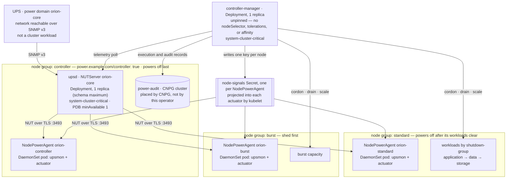

# Pod placement

Components: Foundation & Documentation.
Audience: operators and evaluators.

Where this operator's pods land in the `orion-cluster` example, and — more usefully — what actually
pins each one. Read it with `docs/examples/orion-cluster/`; every placement fact below is declared
in those manifests or in `config/manager/manager.yaml`, not inferred.

## Naming

Every box is a **role**, never a host. Node groups carry the function they serve — `controller`,
`standard`, `burst` — exactly as the Orion example labels them.

This settles the question the diagram was held on. The alternative was to draw named machines, and
CONTRIBUTING.md already answers that: examples use placeholder domains, placeholder registries, and
synthetic cluster names, and must not carry real network topology. It is also the more accurate
drawing. A manifest selects on labels; nothing in this operator can express "this machine," so a
diagram naming machines would depict a placement Kubernetes never promised.

## Placement

## What pins each pod

| Pod | Placed by | Pinned in the example |
| --- | --- | --- |
| `controller-manager` | nothing | **No.** `config/manager/manager.yaml` sets `priorityClassName` and nothing else — no `nodeSelector`, no tolerations, no affinity. It lands wherever the scheduler puts it. |
| `upsd` | `NUTServer.spec.placement.nodeSelector` | Yes — `power.example.com/controller: "true"`. One replica is a schema maximum, not a default. |
| node agents | `NodePowerAgent.spec.nodeSelector` | Yes, one DaemonSet per group. |
| CNPG `power-audit` | CNPG's own `Cluster` spec | Out of scope here; referenced by `spec.storage.cnpg.clusterRef`. |

The agents are the one component that needs no help reaching a tainted control-plane node: the
render gives every agent pod `Exists`/`NoSchedule` and `Exists`/`NoExecute` tolerations, so the
`nodeSelector` is the only thing deciding where they run. `system-node-critical` keeps them from
being preempted by the pressure their own flow is creating.

## The placement caveat

The concentration risk is real but it is *not* what the manifests currently express. Only `upsd` is
pinned to the controller group. The manager is unpinned, so manager-and-`upsd` co-location is
possible but never arranged — and separation is equally unarranged. The example neither creates the
risk nor prevents it; it declines to have an opinion.

That matters because the two pods concentrate different things: `upsd` is the telemetry source and
the manager is the decision-maker, and a node losing power with both on it removes the operator's
input and its ability to act in one step. Anti-affinity between them is what would express a
decision either way, and none exists today. `F-19` does not cover this — it is about multiple `upsd`
replicas not co-scheduling if an HA topology is ever designed, which is a different pair.

Enforcing separation is a change to the shipped manager manifest, not to the example, so it belongs
with the leader-election and replica work in `docs/contributing/design/scaling-and-sizing.md` rather than here.

## Signal delivery crosses the node boundary exactly once

The actuator holds no API credentials (`OD-37`). The only thing reaching it is the
`<agent>-node-signals` Secret, projected by kubelet, with one `<node>.json` key per node. The
manager writes a node's key to actuate it and deletes that key when the actuation completes, so
absence is the record and a replacement actuator pod cannot re-read a stale instruction (`F-87`).
The Secret always carries a `delivery-channel` marker, which is what keeps an empty Secret
distinguishable from a missing one (`F-86`).
