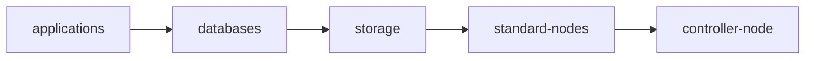

# Shutdown Flow Design

Components: Planning & Execution Logic, Outputs & Publishing.

`ShutdownFlow` is the policy layer that turns UPS events into a safe, reviewable shutdown plan. Its foundation is a declarative dependency graph compiled into ordered shutdown waves.

The graph model is the primary design. Numbered shutdown tiers add coarse ordering that compiles
into ordinary graph edges. Those two are the whole ordering vocabulary.

## Design Goals

- Express workload, namespace, service, storage, and node relationships without hardcoding one site topology.
- Let independent groups shut down concurrently while preserving required ordering.
- Keep dangerous actions dry-run and status-visible before enforcement.
- Reject ambiguous or unsafe plans before execution.
- Publish reusable planner artifacts instead of hiding the plan inside execution.
- Preserve a small Kubernetes status surface while writing durable execution history to PostgreSQL.

## Prior Art

The model combines established patterns rather than inventing new semantics:

- Cluster API `MachineDrainRule`: selector-based Kubernetes resources with ordered drain batches.
- systemd units: separates dependency relationships from ordering relationships.
- Argo Workflows DAGs: compiles dependencies into concurrently executable graph branches.
- kubelet graceful node shutdown: uses priority phases and time budgets for local node shutdown.

`ShutdownFlow` specializes those ideas for Kubernetes workloads plus physical power domains.

## API Model

A flow has triggers and a plan. The preferred plan is `spec.groups`.

```yaml
apiVersion: power.zalud.io/v1alpha1
kind: ShutdownFlow
metadata:
  name: cluster-power-loss
spec:
  managementClusterRef:
    name: production
  mode: DryRun
  triggers:
    - type: RuntimeBelow
      powerDomains: [orion-core]
      runtimeBelowSeconds: 1200
  groups:
    - name: applications
      action: ScaleWorkload
      shutdownTier: 4
      params:
        replicas: "0"
      target:
        namespaceSelector:
          matchLabels:
            power.example.com/shutdown-tier: "4"
      before: [databases]
      timeout: 5m

    - name: databases
      action: ScaleWorkload
      shutdownTier: 3
      params:
        replicas: "0"
      target:
        workloadSelector:
          matchLabels:
            power.example.com/shutdown-tier: "3"
      before: [storage]
      timeout: 10m

    - name: storage
      action: RunHook
      shutdownTier: 2
      hookRef:
        namespace: power-system
        name: flush-storage
      before: [standard-nodes]
      timeout: 15s

    - name: standard-nodes
      action: AgentShutdown
      shutdownTier: 2
      target:
        agentRefs:
          - name: orion-standard
      before: [controller-node]
      timeout: 5m

    - name: controller-node
      action: AgentShutdown
      shutdownTier: 1
      target:
        agentRefs:
          - name: orion-controller
      timeout: 5m
```

The controller compiles this graph into status:

```text
applications -> databases -> storage -> standard-nodes -> controller-node
```



Groups with no dependency path between them can appear in the same compiled wave and execute concurrently.

## Relationship Semantics

`requires`, `before`, and `after` are intentionally separate.

`requires` means the referenced group must remain operational while the current group shuts down. During shutdown, the current group runs before the groups it requires.

```yaml
- name: applications
  requires: [databases]
```

This compiles as `applications -> databases`.

`before` means the current group must finish before the referenced group can begin.

```yaml
- name: databases
  before: [storage]
```

This compiles as `databases -> storage`.

`after` means the current group cannot begin until the referenced group has completed.

```yaml
- name: storage
  after: [databases]
```

This also compiles as `databases -> storage`.

`shutdownTier` is a coarse ordering label. Higher tiers stop earlier; tier 1 is the final valid node
release tier; tier 0 is last-ditch workload-only and is rejected when directly targeted by a flow.
Tier N+1 to tier N compiles into derived graph edges, so tier ordering and authored dependencies use
one dependency engine underneath.

Tiers and `requires` / `before` / `after` are the only ordering inputs. There is no third knob, and
adding one is the thing to resist: a wave is defined as the set of groups with nothing left to wait
for, so any additional key that partitions waves is asserting a dependency the author did not write.

`spec.groups[].phase` used to be exactly that. It arrived with the initial scaffold, described itself
as a tie-breaking hint, and behaved as a hard wave partition — a wave admitted only groups whose
phase numbers matched, so independent same-tier groups were serialized with no diagnostic and the
plan was charged the sum of their timeouts instead of the longest. It was removed in `v1alpha1`
rather than redefined, because nothing needed it: whatever it was reaching for, tiers already
express. See the glossary entry in [the glossary](../../reference/glossary.md), which
disambiguates the two unrelated things this project still calls a phase.

## Compilation

Reconciliation performs a deterministic compile before any enforcement behavior:

1. Validate triggers.
2. Validate group names are unique.
3. Validate every dependency reference points to another group in the same flow.
4. Resolve shutdown tiers from group fields, target labels, and central tier policy.
5. Build directed edges from `requires`, `before`, `after`, and derived tier ordering.
6. Reject dependency cycles.
7. Topologically sort the graph.
8. Emit the dependency graph with edge provenance and explanations.
9. Emit ordered shutdown waves in `status.compiledWaves`.
10. Emit advisory startup wave projections for external consumers.
11. Emit a flattened operator review view in `status.compiledSteps`.
12. Estimate total duration from each wave's longest timeout.
13. Withhold inverted nodes from power-off and publish them in `status.blockedNodeReleases`.

### Tier Inversion

A group whose tier is lower than the tier of a node it runs on is scheduled to keep working after
that node powers off. The node is withheld from power-off for the whole flow, and every group holding
it is named:

```yaml
status:
  blockedNodeReleases:
    - nodeName: worker-07
      reason: ShutdownTierInversion
      nodeTier: 4
      groups: [databases]
      message: node "worker-07" is tier 4 but still runs "databases", scheduled to stop later; the node is withheld from power-off
```

Blocking is the default because its failure mode is powering off less of the cluster than intended,
while the alternative cuts power to work that was declared as still needed. A group accepts going
down with its node by setting `tierInversionPolicy: Allow`:

```yaml
  groups:
    - name: cache
      action: ScaleWorkload
      shutdownTier: 2
      tierInversionPolicy: Allow
```

The inversion is still reported as `ShutdownTierInversionAllowed`, because opting in accepts a risk
rather than retiring it. One dissenting group is enough to hold a node up: if two groups run on the
same node and only one accepts going down with it, powering the node off would still cut power to the
other.

Migrating the workload elsewhere is deliberately not offered as a remedy. Node-local storage means
there is not always anywhere to migrate to, so it cannot be the general answer (OD-18).

Example compiled status shape:

```yaml
status:
  phase: Compiled
  compiledWaves:
    - index: 0
      shutdownTier: 4
      groups: [applications]
      duration: 5m
      cumulativeDuration: 5m
    - index: 1
      shutdownTier: 3
      groups: [databases]
      duration: 10m
      cumulativeDuration: 15m
```

## Published Artifacts

*Components: Outputs & Publishing. Namespace: the artifact contract (GP-6, GP-7, SB-14).*

The planner produces artifacts that can be reviewed and consumed independently of execution.
`nut-operator` is a planner and executor that publishes rich planning artifacts; it is not a
dashboard product.

### Interface Boundary

There is no dedicated UI for v1. The primary interface is Kubernetes:

- CRDs declare desired state.
- GitOps manages configuration changes.
- `kubectl` is sufficient for ordinary operations.
- CR status, Kubernetes Events, controller logs, and PostgreSQL audit records expose current state
  and history.

A future UI is a separate subscriber. It consumes the same artifacts as every other integration and
does not participate in reconciliation, planning, or execution.

### Delivery Contract

There is no bundled message broker in v1. The Kubernetes API watch stream for `ShutdownFlow` is the
pub/sub delivery surface for current planner artifacts and execution summaries. Consumers watch the
resource, cache `metadata.resourceVersion`, and relist when the API server returns a stale watch
window such as `410 Gone`.

Delivery channels have separate jobs:

- `ShutdownFlow.status` is the compact current artifact contract.
- Kubernetes Events are transition breadcrumbs for humans and alert pipelines, not artifact storage.
- PostgreSQL is the durable query and history path for audit, telemetry, decisions, and executions.
- Controller logs carry operator-detail context when debugging a reconcile.

`status.lastPublishTime` and `nutoperator_shutdownflow_publish_timestamp_seconds` are the liveness
heartbeat. They advance on a fixed cadence even when the compiled plan did not change, so subscribers
can distinguish a quiet power state from a stalled publisher.

### Public Conditions

These condition types are part of the public subscriber contract:

- `Accepted`: the flow's structural and planner inputs were accepted. `False` means no compiled plan
  should be treated as trustworthy.
- `Ready`: the flow has a current compiled review surface. `True` does not imply an outage trigger
  is active.
- `Degraded`: an advisory problem exists, including warning diagnostics, audit degradation, or hook
  failure evidence. It is alertable, but it does not automatically block all published artifacts.
- `TriggerEligible`: the current trigger evaluation result. `True` means this flow's trigger criteria
  are eligible now.
- `ExecutionReady`: the execution handoff state. It reports whether execution has started, is blocked
  by a gate, or is recording degraded evidence.

### Published Facts

The operator publishes facts, not external commands:

- Current execution state.
- Compiled execution plan.
- Dependency graph.
- Resolver-derived power-domain closures.
- Shutdown waves.
- Advisory startup wave projection.
- Wave progress.
- Planner explanations and diagnostics.
- Edge explanations and provenance.

The planner owns graph construction and explanation. The executor owns execution progress and
evidence. The publisher makes those facts available through Kubernetes status, Events, logs, and
PostgreSQL records.

### Explanations

Every dependency explains itself.

`status.publishedArtifact.powerDomains` publishes one entry per derived power domain: the domain
name, the UPS roots, the full member closure, and the node/infrastructure split. It is the same
resolver-derived closure trigger evaluation uses; `UPSDevice.spec.powerDomains` remains the authored
root label, not the subscriber-facing membership list.

Examples:

- Declared: `applications requires databases` because the `ShutdownFlow` author declared it.
- Derived: `node-a depends on switch-2` because inventory says `switch-2` carries the node's
  control path.
- Policy: `control-plane-1 stays late` because quorum policy requires a minimum viable control
  plane until terminal waves.

These explanations travel with the graph artifact so users and external systems can answer "why"
without log archaeology.

### Subscribers

Subscribers consume published artifacts. They do not own shutdown planning.

Examples:

- Recovery orchestration.
- Dashboards.
- Documentation generators.
- Monitoring systems.
- Future automation.

The boundary is:

> `nut-operator` owns planning and shutdown.
>
> Other systems consume the published plan.

Recovery is a subscriber concern. The operator may publish advisory startup wave projections, but it
does not execute recovery or become the bring-up controller.

### Worked Subscriber Example

A simple subscriber can use the Kubernetes watch stream directly:

```sh
kubectl get shutdownflows.power.zalud.io rack-a-conservation \
  --watch --output-watch-events -o json |
jq -c '
  select(.type != "ERROR") |
  .object as $flow |
  {
    resourceVersion: $flow.metadata.resourceVersion,
    configHash: $flow.status.configHash,
    lastPublishTime: $flow.status.lastPublishTime,
    compiledWaves: $flow.status.compiledWaves,
    powerDomains: $flow.status.publishedArtifact.powerDomains,
    graphEdges: $flow.status.publishedArtifact.graph.edges,
    triggerEligible: ($flow.status.conditions[]? | select(.type == "TriggerEligible")),
    executionReady: ($flow.status.conditions[]? | select(.type == "ExecutionReady"))
  }'
```

That subscriber stores the last seen `metadata.resourceVersion` for watch continuity and the last
seen `status.configHash` for artifact change detection. It regenerates diagrams, documentation, or
dashboards only when the config hash changes. It treats stale `status.lastPublishTime` or a stale
`nutoperator_shutdownflow_publish_timestamp_seconds` series as a publisher liveness problem.

Recovery automation reads `status.publishedArtifact.startupWaves` after its own power-return logic
says recovery is appropriate. The operator publishing a startup projection is not an instruction to
start anything.

### Visualization

Graph visualization is exported, not hand-built into a frontend:

- Mermaid.
- Graphviz/DOT.
- D2.

AI-assisted diagramming tools can consume those exports or the structured artifact. Rendered
diagrams are views of the plan, not sources of truth.

## Execution Semantics

Execution uses the compiled waves, not raw YAML order.

- Every group in a wave is eligible to run concurrently.
- The next wave cannot start until all required completion conditions in the current wave are satisfied.
- A failed group aborts the flow by default.
- `abortPolicy.behavior: ContinueSafeSteps` can allow explicitly safe follow-up actions, such as notification.
- Node poweroff groups are terminal vertices and stay last for their power domain.
- Control-plane or controller nodes carry explicit late dependencies, not just a low tier number.

Execution records, action attempts, telemetry snapshots, and approval evidence belong in PostgreSQL. CR status remains a current summary and review surface.

Execution also publishes current state and wave progress as facts. Subscribers may watch those facts, but the operator does not delegate shutdown ordering or host actuation to subscribers.

### Rehearsal Execution

A rehearsal is an approved `Enforce` execution requested before a real outage so the planner has
observed duration history. It is real work against real targets, not dry-run output, and audit
records plus `status.lastExecution.rehearsal` label it separately from power-triggered executions.

The delivery mechanism is deliberately generic: change the
`power.zalud.io/rehearsal-request` annotation to a new non-empty token. A Kubernetes `CronJob`,
GitOps commit, CI job, dashboard action, or non-Kubernetes system can own that token change. The
operator executes that request once for the current flow generation, mode, plan hash, and selected
UPS devices.

```yaml
metadata:
  annotations:
    power.zalud.io/approved-for-enforce: "true"
    power.zalud.io/rehearsal-request: "baseline-2026-08"
    power.zalud.io/rehearsal-reason: "monthly timing sample"
spec:
  mode: Enforce
  safety:
    approvalAnnotation: power.zalud.io/approved-for-enforce
```

Clear the annotation after the requesting system observes completion, or change the token to request
another sample. Rehearsal samples feed observed-duration estimates by default; set
`spec.rehearsal.includeInEstimates: false` when a run should remain visible in audit history but not
shape future estimates.

## Resource Semantics

Workload controllers such as Deployments and StatefulSets are normally scaled, suspended, or quiesced. Deleting their Pods directly is only appropriate for exceptional overrides because controllers may recreate Pods.

Pods are concrete execution instances. They are useful for eviction, wait conditions, and diagnostics, but they are not the main long-lived policy unit.

Namespaces are grouping and policy boundaries. A normal shutdown flow does not delete namespaces.

Services are used for traffic withdrawal and readiness boundaries. Backing workloads remain responsible for graceful shutdown.

Nodes are terminal graph vertices. A node cannot power off until every workload, storage operation, and cluster responsibility assigned to that node has cleared.
Node-oriented groups may combine `nodeSelector` with `nodeSelectorRequirements`; both are evaluated
as Kubernetes label requirements, and the requirement form is what enables native numeric `Gt`/`Lt`
matches for tier ranges. Namespace and workload targeting stay on `metav1.LabelSelector`.

## Safety Gates

`ShutdownFlow` defaults to `DryRun`. `Enforce` requires an explicit approval annotation:

```yaml
metadata:
  annotations:
    power.zalud.io/approved-for-enforce: "true"
spec:
  mode: Enforce
  safety:
    approvalAnnotation: power.zalud.io/approved-for-enforce
```

This gate is separate from `NodePowerAgent` actuation approval. A production deployment requires both a flow approval and a node-agent actuation approval before host shutdown is rendered.

## Linear Fallback

`spec.steps` remains available for small or test installations that need a simple ordered list. It is not the preferred model for production because it cannot express dependency relationships or concurrent branches.
