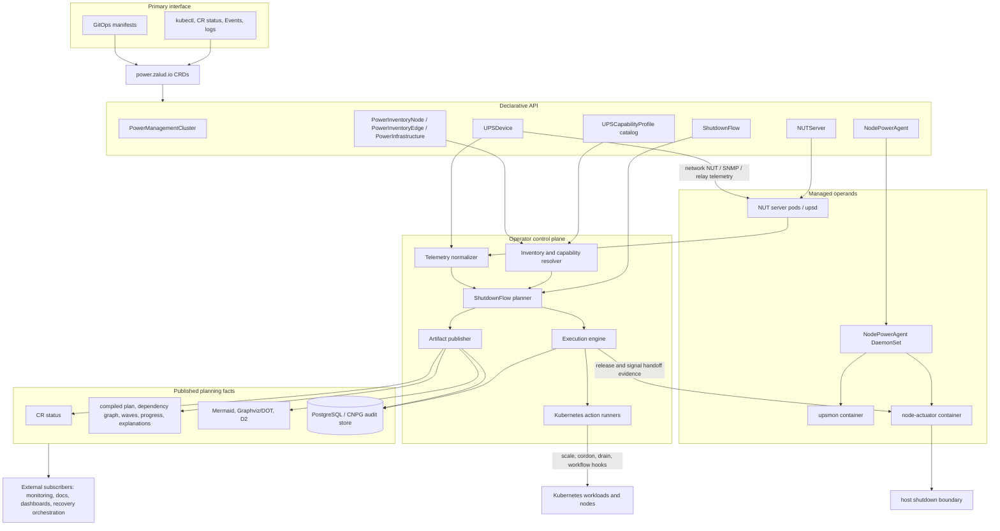

# System Architecture Diagram

Components: Cross-cutting.

This diagram shows the finalized service shape for `nut-operator`: Kubernetes resources are the
interface, the operator compiles and publishes planning facts, PostgreSQL stores durable history,
and node-local agents own the final host boundary.

The operator owns planning and shutdown execution. Recovery, dashboards, documentation generators,
and other automation consume the published facts instead of becoming part of the core project.
