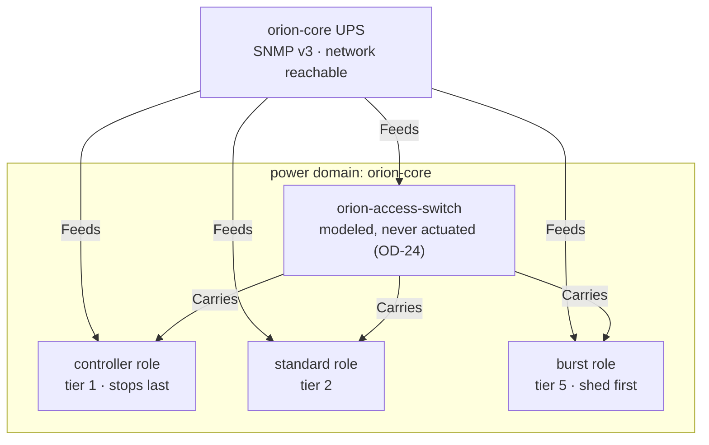

# Orion Cluster Example

Components: Foundation & Documentation.

A complete worked example: one power domain, one UPS, three node roles, and a conservation flow that
runs when the domain goes on battery. It uses placeholder domains and synthetic role names
throughout, so it can be read and copied without carrying anyone's real topology
(see [CONTRIBUTING.md](../../../CONTRIBUTING.md)).

Everything here is `mode: DryRun` and `actuatorPolicy: Simulate`. Nothing in this directory can halt
a machine as written; see [Making it real](#making-it-real).

## The architecture



Four layers, applied in this order because each depends on the one above it:

| Layer | File | What it establishes |
| --- | --- | --- |
| Cluster and device | `ups-and-server.yaml` | The `PowerManagementCluster`, the UPS, and the `upsd` operand that reads it |
| Topology | `inventory.yaml` | Which nodes the UPS feeds, and what carries them |
| Node agents | `nodepoweragents.yaml` | One DaemonSet per node role, each monitoring the domain's `upsd` |
| Policy | `shutdownflow-conservation.yaml` | The hook and the ordered flow |

Pod placement — what lands where, and what does and does not pin it — is drawn separately in
[example-pod-placement.md](../../diagrams/example-pod-placement.md).

## Roles, not hosts

- `orion-controller` — the control-plane group. Holds the operator and `upsd`, so it stops last.
- `orion-standard` — steady-state workers, drained and powered down during conservation.
- `orion-burst` — optional capacity, shed first.
- `orion-core` — the physical power domain covered by one network-reachable UPS.

Expected node labels, applied by whoever provisions the nodes:

```yaml
power.example.com/controller: "true"
power.example.com/node-group: controller   # or standard, or burst
power.example.com/power-domain: orion-core
```

## Membership is derived, not declared

`UPSDevice.spec.powerDomains` names the domain. **Membership in it is computed** by walking `Feeds`
edges out from the UPS (`IN-7`), which is why `inventory.yaml` exists and is not optional decoration.

This is the layer that makes `powerDomains: [orion-core]` on the flow's triggers mean anything.
Without the edges, the domain resolves to a UPS with no members, a domain-scoped trigger has nothing
to scope to, and `OD-14`'s partial-domain pruning has no membership to prune against. A cluster can
run without modeling topology; it just cannot answer "which nodes does this outage affect."

`Carries` edges model how a node is reached. Omitting them is a warning
(`CommunicationPathUnmodeled`), never an error, because an unmodeled communication path costs only
communication ordering — which `PL-21` defers past v1 anyway. Missing `Feeds` coverage is the error
(`PowerPlanningOrphan`), because a node no UPS reaches cannot be planned for at all.

## Ordering versus membership

Two different label questions get confused constantly, so this example keeps them apart.

**Ordering is numeric.** `shutdownTier` on each group, and `roles.shutdownTier` on each inventory
node. Tiers count down: a higher number stops earlier, tier 1 is the final orchestrated stop, tier 0
is last-ditch (`OD-4`).

**Membership is named.** Workload and namespace labels say which things belong together:

```yaml
power.example.com/shutdown-group: application   # or data, or storage
```

These names never imply an order, and nothing derives one from them.

The operator *does* support deriving a tier from a label — a group that omits `shutdownTier` falls
back to the numeric value of the cluster's `shutdownTiers.labelKey` (default
`power.zalud.io/shutdown-tier`) found in its own selector. This example does not use that path: every
group states its tier outright, which is the clearer thing to copy. Writing a numeric tier into a
label *and* onto the group puts the same number in two places with nothing keeping them in
agreement, and while the group is the one with authority whenever it is set, that is not obvious to
someone reading the labels.

## The dependency graph is the source of truth

Ordering comes from two places and no others: the numbered tier a group declares, and the `before` /
`after` edges it writes. Everything else about the compiled shape — which groups share a wave, how
long each wave costs — is derived. Here the chain is:

```text
burst-capacity -> application-workloads -> data-workloads -> storage-services -> standard-nodes -> controller-node
```

## Tier inversion, on purpose

Burst nodes are tier 5, so they shut down before `application-workloads` at tier 4. An application
pod on a burst node is therefore scheduled to outlive its host — a tier inversion (`OD-18`).

The default remedy is `Block`, which withholds the inverted node from power-off for the entire flow.
That is right almost everywhere and wrong here: it would keep a burst node running specifically to
protect workloads the cluster already designated as sheddable. So `application-workloads` sets
`tierInversionPolicy: Allow`, which states the intent — burst capacity takes its workloads with it.

This is the one place in the example where the safe default is deliberately overridden, which is why
it is called out rather than left to be discovered.

## What this example does not include

- **Secrets.** `orion-core-ups-snmp`, the NUT TLS material, and the hook's `Authorization` header
  are referenced and not shipped.
- **The CNPG cluster.** `spec.storage.cnpg.clusterRef` points at `power-audit`, which CNPG owns.
- **Kubernetes Node objects and their labels.** Provisioned outside this operator.

## Making it real

In order, and not before a dry run has been reviewed:

1. Confirm compiled plans and `status.planFeasibility` look right in `DryRun`.
2. Move `NodePowerAgent.spec.shutdown.actuatorPolicy` from `Simulate` to `PowerOff` — this is the
   step that gives a node the ability to halt, and it needs `CAP_SYS_BOOT` and `hostPID` to be
   admissible (see [node-agent-operand.md](../../design/node-agent-operand.md)).
3. Move the flow's `mode` from `DryRun` to `Enforce`. `safety.requireManualApproval` is on, so an
   enforce-mode run still waits for the approval annotation.
