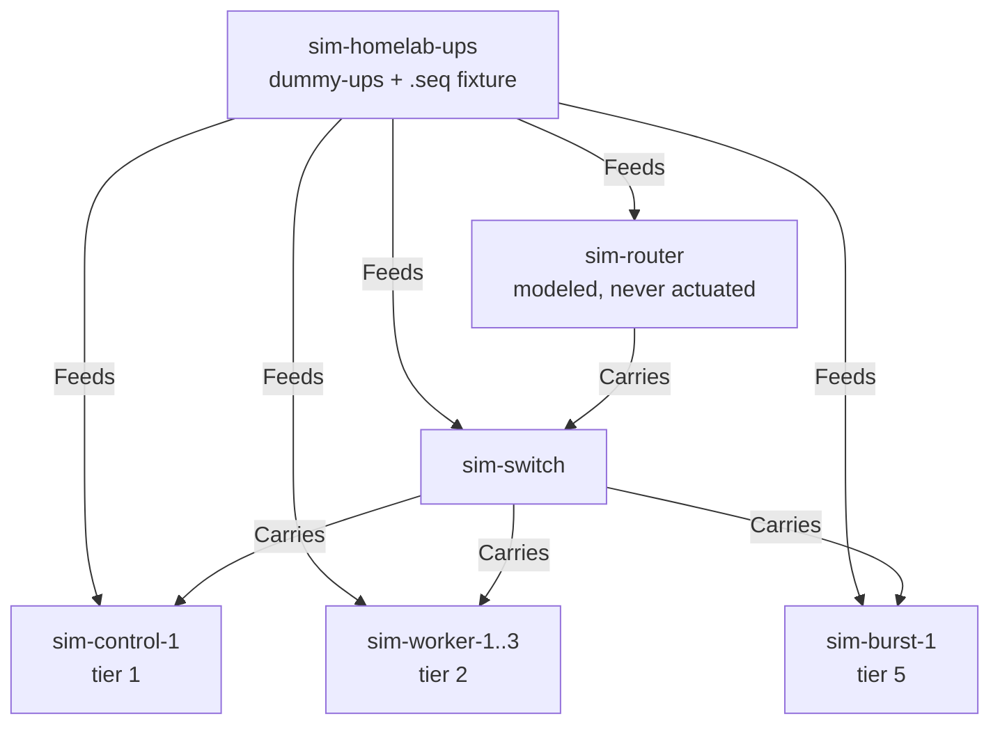

# Homelab-shaped simulation

Components: Planning & Execution Logic, Node Agent / DaemonSet.

A small cluster on one UPS: **one control plane, three steady workers, one burst worker**, behind a
switch behind a router. Synthetic names throughout.

The flow authors **no ordering except tiers** — no `after`, and exactly one `before` edge whose
reason is explained below. Everything else about the wave structure is derived.

## What it compiles to

```text
wave 0   tier 5   2m0s   [shed-burst-node]
wave 1   tier 4   2m0s   [scale-api  scale-batch  scale-web]
wave 2   tier 3   5m0s   [quiesce-databases]
wave 3   tier 2   5m0s   [drain-workers]
wave 4   tier 2   3m0s   [stop-workers]
wave 5   tier 1   3m0s   [stop-control-plane]
```

Total 20m0s.

**Wave 1 is the interesting one.** Three groups, no edges between them, same tier — so the planner
puts all three in one wave and they run concurrently. Nothing in the flow said to do that. Delete a
tier number or change one to 3, and the wave structure changes underneath you, which is what makes
this a test of wave generation rather than a recital.

## Where derived grouping stops being enough

Waves 3 and 4 are both tier 2 and are split by the only hand-authored edge in the scenario.

Without it, `drain-workers` and `stop-workers` co-wave — they share a tier and have no relationship
the planner can see. A drain racing its own nodes' shutdown is not what anyone means, so the edge
says so:

```yaml
- name: drain-workers
  shutdownTier: 2
  before:
    - stop-workers
```

This is worth internalising before writing a loose flow of your own: **tiers order things that are
in different tiers.** Two pieces of work in the same tier are concurrent unless you say otherwise,
and "obviously the drain goes first" is not something the tier number conveys.

Note also that the planner does not currently warn about this. `PL-25` specifies co-wave contention
detection — two groups sharing a wave while targeting workloads on the same node can violate a
PodDisruptionBudget — and it is not implemented, so a missing edge here is silent.

## Topology



Power is flat — the UPS feeds everything directly. The communication path is two hops, router to
switch to nodes, so the graph knows losing the router takes the switch's nodes with it even though
their power is unaffected. That independence is why `Feeds` and `Carries` are separate relations
rather than one graph.

The router and switch are modeled and never actuated (`OD-24`).

## Apply

Into a namespace already provisioned by a `PowerManagementCluster`:

```sh
kubectl apply -f inventory.yaml
kubectl apply -f ups-and-flow.yaml
kubectl apply -f nodepoweragents.yaml
```

Expected node labels:

```yaml
power.example.com/node-group: control   # or worker, or burst
```

## What to watch

```sh
kubectl get shutdownflow sim-homelab-conservation -o jsonpath='{.status.compiledPlan.waves}'
```

The fixture holds Online for 2 minutes, then decays through two `OB` states to `OB LB`. With a 2m
`OnBattery` hold on the trigger, eligibility flips partway through the battery run rather than the
instant line power drops.

Everything is `DryRun` and `Simulate`. Nothing here can halt a node.
