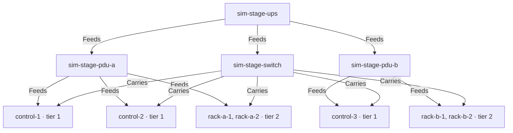

# Multistage simulation

Components: Inventory System, Planning & Execution Logic.

Cascaded power: **one UPS feeding two PDUs, each PDU feeding a rack**, with a three-member control
plane split across both racks. Synthetic names throughout.

"Multistage" here means stages of *power distribution*, not stages of shutdown. If you meant
something else — staged rollout across sites, or a cluster shut down in independent phases — say so
and this becomes a different scenario.

## Why the extra hop matters

Every other example feeds nodes directly from the UPS, so domain membership is one hop and the
closure derivation never gets tested. Here a node's membership is only discoverable by walking
`UPS → PDU → node`, and nothing in the flow ever names a PDU.

Compiling this topology derives:

```text
domain "sim-multistage"
  ups:    [sim-stage-ups]
  nodes:  [sim-stage-control-1  sim-stage-rack-a-1  sim-stage-rack-b-1  ...]
  infra:  [sim-stage-pdu-a  sim-stage-pdu-b  sim-stage-switch]
```

The nodes arrive in the domain through their PDU, and the PDUs arrive as infrastructure. A
domain-scoped trigger then has real membership to scope against, which is what `OD-14` needs.

## What it compiles to

```text
wave 0   tier 4   3m0s   [scale-applications]
wave 1   tier 3   6m0s   [quiesce-databases]
wave 2   tier 2   5m0s   [drain-rack-a  drain-rack-b]
wave 3   tier 2   3m0s   [stop-rack-a   stop-rack-b]
wave 4   tier 1   3m0s   [stop-control-plane]
```

Total 20m0s.

**The racks are peers.** Nothing orders rack A against rack B, so both drain concurrently and both
stop concurrently. That is the right answer for racks that are genuinely independent, and the wrong
one if they are not — if rack B holds storage that rack A mounts, that relationship has to be an
edge, because no tier number expresses it.

Adding `before: [drain-rack-b]` to `drain-rack-a` turns waves 2 and 3 into four serial waves. The
compiled plan changes immediately, which makes this scenario a cheap way to see the cost of an
ordering constraint before committing to it in a real cluster.

## Topology



Power is cascaded; the communication path is flat. The control plane is deliberately split 2/1
across the PDUs, so losing PDU A costs quorum and losing PDU B does not — the asymmetry that makes
`PL-23` quorum enforcement meaningful rather than theoretical.

Both racks share one UPS, so they share one power domain and fall together. Giving each rack its own
UPS would split them into two domains and make this a partial-outage scenario instead; that variant
does not exist yet.

## Apply

```sh
kubectl apply -f inventory.yaml
kubectl apply -f ups-and-flow.yaml
```

Expected node labels:

```yaml
power.example.com/node-group: control
power.example.com/rack: a            # or b
```

## A note on `Feeds` edges

Every `Feeds` edge here carries `input: psu-a`. That qualifier is **required** (`IN-4`) — omitting it
is a hard `FeedInputRequired` error, because an unqualified feed cannot distinguish two redundant
supplies from two separate ones. It is the first thing to check when a hand-written topology is
rejected.

Everything is `DryRun` and `Simulate`.
