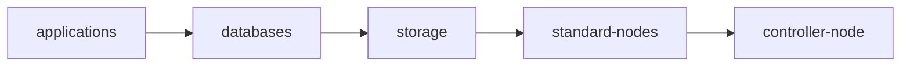

# Shutdown Flow Design

`ShutdownFlow` is the policy layer that turns UPS events into a safe, reviewable shutdown plan. Its foundation is a declarative dependency graph compiled into ordered shutdown waves.

The graph model is the primary design. Numeric phases are only a convenience for simple ordering and for keeping generated plans readable.

## Design Goals

- Express workload, namespace, service, storage, and node relationships without hardcoding one site topology.
- Let independent groups shut down concurrently while preserving required ordering.
- Keep dangerous actions dry-run and status-visible before enforcement.
- Reject ambiguous or unsafe plans before execution.
- Publish reusable planner artifacts instead of hiding the plan inside execution.
- Preserve a small Kubernetes status surface while writing durable execution history to PostgreSQL.

## Prior Art

The model combines established patterns rather than inventing new semantics:

- Cluster API `MachineDrainRule`: selector-based Kubernetes resources with ordered drain batches.
- systemd units: separates dependency relationships from ordering relationships.
- Argo Workflows DAGs: compiles dependencies into concurrently executable graph branches.
- kubelet graceful node shutdown: uses priority phases and time budgets for local node shutdown.

`ShutdownFlow` specializes those ideas for Kubernetes workloads plus physical power domains.

## API Model

A flow has triggers and a plan. The preferred plan is `spec.groups`.

```yaml
apiVersion: power.zalud.io/v1alpha1
kind: ShutdownFlow
metadata:
  name: cluster-power-loss
spec:
  mode: DryRun
  triggers:
    - type: RuntimeBelow
      powerDomains: [orion-core]
      runtimeBelowSeconds: 1200
  groups:
    - name: applications
      action: ScaleWorkload
      params:
        replicas: "0"
      target:
        namespaceSelector:
          matchLabels:
            power.example.com/shutdown-tier: application
      before: [databases]
      phase: 10
      timeout: 5m

    - name: databases
      action: ScaleWorkload
      params:
        replicas: "0"
      target:
        workloadSelector:
          matchLabels:
            power.example.com/shutdown-tier: data
      before: [storage]
      phase: 20
      timeout: 10m

    - name: storage
      action: RunWorkflow
      params:
        workflow.templateRef: flush-storage
      target:
        namespaces: [storage]
      before: [standard-nodes]
      phase: 30
      timeout: 10m

    - name: standard-nodes
      action: AgentShutdown
      target:
        agentRefs:
          - name: orion-standard
      before: [controller-node]
      phase: 40
      timeout: 5m

    - name: controller-node
      action: AgentShutdown
      target:
        agentRefs:
          - name: orion-controller
      phase: 90
      timeout: 5m
```

The controller compiles this graph into status:

```text
applications -> databases -> storage -> standard-nodes -> controller-node
```



Groups with no dependency path between them can appear in the same compiled wave and execute concurrently.

## Relationship Semantics

`requires`, `before`, and `after` are intentionally separate.

`requires` means the referenced group must remain operational while the current group shuts down. During shutdown, the current group runs before the groups it requires.

```yaml
- name: applications
  requires: [databases]
```

This compiles as `applications -> databases`.

`before` means the current group must finish before the referenced group can begin.

```yaml
- name: databases
  before: [storage]
```

This compiles as `databases -> storage`.

`after` means the current group cannot begin until the referenced group has completed.

```yaml
- name: storage
  after: [databases]
```

This also compiles as `databases -> storage`.

`phase` is an ordering hint. Lower phases are selected first when multiple groups are ready at the same time. Explicit dependency edges always take precedence over phases.

## Compilation

Reconciliation performs a deterministic compile before any enforcement behavior:

1. Validate triggers.
2. Validate group names are unique.
3. Validate every dependency reference points to another group in the same flow.
4. Build directed edges from `requires`, `before`, and `after`.
5. Reject dependency cycles.
6. Topologically sort the graph.
7. Emit the dependency graph with edge provenance and explanations.
8. Emit ordered shutdown waves in `status.compiledWaves`.
9. Emit advisory startup wave projections for external consumers.
10. Emit a flattened operator review view in `status.compiledSteps`.
11. Estimate total duration from each wave's longest timeout.

Example compiled status shape:

```yaml
status:
  phase: Compiled
  compiledWaves:
    - index: 0
      phase: 10
      groups: [applications]
      duration: 5m
      cumulativeDuration: 5m
    - index: 1
      phase: 20
      groups: [databases]
      duration: 10m
      cumulativeDuration: 15m
```

## Published Artifacts

The planner produces artifacts that can be reviewed and consumed independently of execution:

- Compiled execution plan.
- Dependency graph.
- Shutdown waves and advisory startup wave projections.
- Planner explanations for decisions, warnings, and feasibility verdicts.
- Per-edge explanations, such as "declared by `requires`" or "inferred from inventory `feeds` edge."

The operator publishes current artifacts through CR status and Kubernetes Events, and writes durable copies to PostgreSQL. Visualization exporters render Mermaid, Graphviz/DOT, and D2 from the structured graph. Those exports are for existing tools and future consumers, not an embedded web UI.

## Execution Semantics

Execution uses the compiled waves, not raw YAML order.

- Every group in a wave is eligible to run concurrently.
- The next wave cannot start until all required completion conditions in the current wave are satisfied.
- A failed group aborts the flow by default.
- `abortPolicy.behavior: ContinueSafeSteps` can allow explicitly safe follow-up actions, such as notification.
- Node poweroff groups are terminal vertices and stay last for their power domain.
- Control-plane or controller nodes carry explicit late dependencies, not just a high phase number.

Execution records, action attempts, telemetry snapshots, and approval evidence belong in PostgreSQL. CR status remains a current summary and review surface.

Execution also publishes current state and wave progress as facts. Subscribers may watch those facts, but the operator does not delegate shutdown ordering or host actuation to subscribers.

## Resource Semantics

Workload controllers such as Deployments and StatefulSets are normally scaled, suspended, or quiesced. Deleting their Pods directly is only appropriate for exceptional overrides because controllers may recreate Pods.

Pods are concrete execution instances. They are useful for eviction, wait conditions, and diagnostics, but they are not the main long-lived policy unit.

Namespaces are grouping and policy boundaries. A normal shutdown flow does not delete namespaces.

Services are used for traffic withdrawal and readiness boundaries. Backing workloads remain responsible for graceful shutdown.

Nodes are terminal graph vertices. A node cannot power off until every workload, storage operation, and cluster responsibility assigned to that node has cleared.

## Safety Gates

`ShutdownFlow` defaults to `DryRun`. `Enforce` requires an explicit approval annotation:

```yaml
metadata:
  annotations:
    power.zalud.io/approved-for-enforce: "true"
spec:
  mode: Enforce
  safety:
    approvalAnnotation: power.zalud.io/approved-for-enforce
```

This gate is separate from `NodePowerAgent` actuation approval. A production deployment requires both a flow approval and a node-agent actuation approval before host shutdown is rendered.

## Linear Fallback

`spec.steps` remains available for small or test installations that need a simple ordered list. It is not the preferred model for production because it cannot express dependency relationships or concurrent branches.
